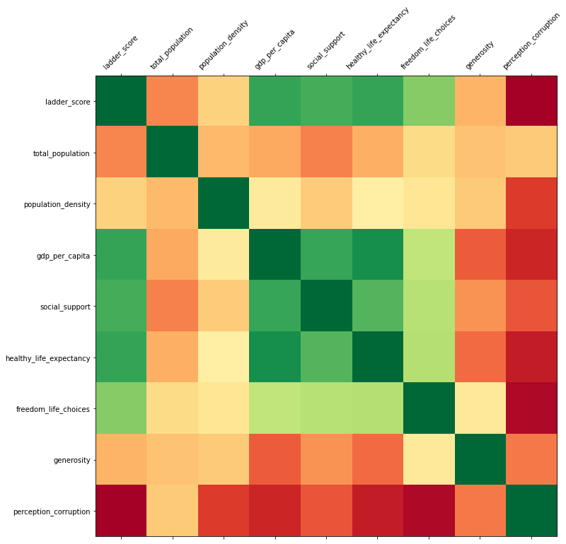

# ETL PROJECT

## Extract Transform Load WORLD HAPPINESS and Population

### Intention of the Repository

This Repository has been made to summit the project assignment for our Data Science Bootcamp at Northwestern University

ETL PROJECT

Students: Jorge Daniel Atuesta, John Strode & John Cass

May, 2021

### Inside of this repository

In this repository, the reader will encounter our solution to the ETL project. The repository is organized in folders and a README.md (The file you are currently reading). Here is the list of the folders and their contents so you can navigate through them.

I hope you find our work not only to be complete but to display all the knowledge learned throughout this portion of the Data Science Bootcamp at Northwestern University.

1. **Images**: Inside this folder, you will find the images used to create this README.MD file. *You can skip this folder if you want*.
2. **Resources**: Inside this folder, you will have the chance to access our code for the assignment and all the output data. I encourage you to take a look inside as you will find the solution to the project. Here are what's inside:

* *Templates*: You will the two jupyter notebooks one for the ETL challange and the other for analysis.
* *data** This is the csv files used.
* *Program files*: This contains the queries that we used for our project in Postgress

3. **README.md**: it's the current file you are reading. We strongly suggest navigating through it and look at the project's objective solution and analysis.
4. **Project_Requirements**: You will find the requierments stablished by the Northwestern Data Visualization Boot camp. 

I hope you find our work not only to be complete but to display all the knowledge learned throughout this portion of the Data Science Bootcamp at Northwestern University.

## ETL Project

### Project's Aim

Happiness, a word that evokes several emotions in humans. It's that feeling most of us are seeking. But what if there is a shortcut to experiencing this emotion. In this project, we were able to look at what country is the happiest and what the total population is per country. Yes, that's right, the number of people around you might be a predominant factor in the level of happiness one experiences, or so we think.

To do this, we pulled two data sets, one describing each country's happiness level and the other that contained the population amount per country. We then merged these two data sets to create on master data set on our database for future analysis. When then proceeded to analyze the results to identify if population has a correlation with the happiness index a country has.

#### Project's Challanges

1. Find two seperate data sets that have a relationship
2. Read seperatly the data sets.
3. Individually clean the data
   1. Looking for N/A
   2. Looking for duplicated values
   3. Dropping unwanted columns
   4. Identifying total countries in both data sets
   5. Matching the total countries of both data sets
4. Creating new data frames
5. Pushing the data sets to our data base
6. Reading the data on out data base
7. Joining both data sets to create one data set with both sets of information

#### Project's Documentation

On the following session you will encounter the documentation for our ETL process. This means we will go over step by step. 
##### Variable defenitions of the data sets

1. Rank: This variable was created to show case the positon of a country based on the ladder score. The higher the ladder score the better ranking a country got. As an example, Finland was the country that had the highest ladder score so it was ranked number 1 in the ranking scale, showcasing that it was the country with the highest happiness reported in the data set for the year 2019.
2. Ladder_score: Cantril Ladder is a measure of life satisfaction.
3. Gdp_per_capita: The gross domestic product is the monetary value of all finished goods and services made within a country during a specific period
4. Social_support : The extent to which Social support contributed to the calculation of the Happiness Score.
5. Healthy_life_expectancy: The extent to which healthy life expectancy contributed to the calculation of the Happiness Score
6. Freedom_life_choices: The extent to which Freedom contributed to the calculation of the Happiness Score.
7. Generosity: The extent to which Generosity contributed to the calculation of the Happiness Score.
8. Perception_corruption: The extent to which Perception of Corruption contributes to Happiness Score.
9. Ladder_score_dystopia: Dystopia is an imaginary country that has the world’s least-happy people.

##### Step 1:

Creating the idea. We accomplished this by brainstorming on potential relationship bewteen variables that would or could indicate some causation. Even though we are not analysing the results we created a final model to show case the final results. At the end of the day we wanted this to make sense.

##### Step 2:

Gatehring the data. After choosing our main topic world happiness and selecting what we considered to be a variable that had on effect on it (population and population density) we went into data sources to gather our initial data sets. We decided to go with Kaggel and two different data sources that had the information we needed. Source one was the World Happiness data set and the second source was the population per country.

##### Step 3:

After we downloaded our files into our computer then we read said files on a jupyter note book using pandas.

##### Step 4:

We looked at the data and started the transforming process to get our final two data sets.

* 4.1

  * World Happiness Data:
    * Create a filtered dataframe from specific columns
      * "Country name", "Ladder score"
    * We renamed the columns to fit our needs:
      * "Country name": "Country_name",
        "Ladder score": "Ranking"
    * Clean the data by dropping duplicates and setting the index
    * Drop any duplicated data adn printed the unique values as a total
    * We created a column named rank. This will indicate the rank of a country according to the total ladder score provided in the original data set.
      * We filtered by ladder score.
      * created a list of 1 - 130
      * created the column rank
      * inserted the list values in rank column
* 4.2

  * Getting the list of countries in the data set
    * country_names variable
* 4.3-4.4

  * Population Data:

    * We transformed the data frame using only the following columns:

      * "Location", "Time","PopTotal", "PopDensity"
    * We renamed the columns to fit our needs:

      * "Location": "Country_name",
        "Time": "Year",
        "PopTotal":"Total_Population",
        "PopDensity" : "Population_Density"
    * We transformed the data to show only the data for the year 2019 to match out happiness data
    * When then filtered the country_names to match the country_names on our happieness data city_names
    * The total countries in this data set matched after transforming our data with the ladder data set
* 4.5

  * Filtering the data of populaiton df to match the country names in the world_happienss_df
  * Drop additional columns such as index and year
* 4.6

  * We set the ID as an index (pop data)
  * Display final df (pop data)
* 4.7

  * checking the lenght of data set to see if they match
  * Since they did not match we had to transforme the data even more.
* 4.8

  * Getting list of country_names in population df
* 4.9

  * Filtering the data of world happiness df to match the country names in the final_pop_df
  * Sorting values by country name, reseting the index of the country to match the other database and dropping extra column after reset index
  * Checking country with highest rank
* 4.10

  * Setting id as index on df to create the key (word data)
* 4.11

  * Getting final df
* 4.12

  * Checking new length of happines data frame to see if it matches the pop data frame
* 4.13

  * Merging the df to see if it worked using pandas in jupyterlab

##### Step 5:

We created our data base using postgres

* 5.1

  * Confirm tables
* The name of the data base is world_happiness_db

##### Step 6:

We created the tables that we wanted the data to be stored in, and, gave it its primary key

* DROP statement in case we had existing tables
  * DROP TABLE IF EXISTS world_happiness;
  * DROP TABLE IF EXISTS population;
  * DROP TABLE IF EXISTS merged;
* Table 1: world_happiness
  * CREATE TABLE world_happiness (
    id INT PRIMARY KEY,
    Country_name TEXT,
    Ranking FLOAT
    );
* Table 2: population
  * CREATE TABLE population (
    id INT PRIMARY KEY,
    Country_name TEXT,
    Total_Population INT,
    Population_Density INT
    );

##### Step 7:

We created the data base connection from out jupyter notebook

* connection_string = "postgres:postgres@localhost:5432/world_happiness_db"
  engine = create_engine(f'postgresql://{connection_string}')

##### Step 8:

We confirmed the connection with the following query:

* engine.table_names()

##### Step 9:

We loaded the data into our database

* population_transformed.to_sql(name='population', con=engine, if_exists='append', index=True)
* world_happiness_transformed.to_sql(name='world_happiness', con=engine, if_exists='append', index=True)

##### Step 10:

Inside postgres we ran the following queries to see if the data was properly read and stored

* SELECT * FROM population;
* SELECT * FROM world_happiness;

##### Step 11:

We joined both data sets using the primary key in order to display the ranking acording to the happiness index and the total population as well as the population density of each country in the year of 2019. We named this table merged

* CREATE TABLE merged AS
  SELECT world_happiness.id, world_happiness.country_name, world_happiness.ranking, population.total_population, population.population_density
  FROM world_happiness
  JOIN population
  ON world_happiness.id = population.id;

##### Step 12:

We read the data to inspect that it was joined properly and that all the data was displayed in one table.

* SELECT * FROM merged;

#### Project's Outcome

On this section you can find screen shots of our step by step described on the previouse section "Project's Documentation"

##### Step 1

##### Step 2

##### Step 3

##### Step 4

* 4.1
  * 
* 4.2
  * 
* 4.3
  * 
* 4.4
  * 
* 4.5
  * 
* 4.6
  * 
* 4.7
  * 
* 4.8
  * 
* 4.9
  * 
* 4.10
  * 
* 4.11
  * 
* 4.12
  * 
* 4.13
  * 

##### Step 5

##### Step 6

##### Step 7

##### Step 8

##### Step 9

##### Step 10

##### Step 11

##### Final Data Base Table

## Analysis

### Aim

Statistically prove of there is a correlation bewteen the level of happiness a country expiriences and the total population as well as the population density in the year 2019.

### Hypothesis

Hypothesis no. 1: There is a relationship bewteen the level of happiness a country expiriences and the total population a country has in the year 2019.

Null hypothesis no. 1: There is no relationship bewteen the level of happiness a country expiriences and the total population a country has in the year 2019.

Hypothesis no. 2: There is a relationship bewteen the level of happiness a country expiriences and the total population density a country has in the year 2019.

Null hypothesis no.2: There is no relationship bewteen the level of happiness a country expiriences and the total population density a country has in the year 2019.

### Tests being conducted

Pearsons Correlation test bewteen total population variable and the following variables: 'ladder_score', 'gdp_per_capita', 'social_support', 'healthy_life_expectancy', 'freedom_life_choices', 'generosity', 'perception_corruption', 'ladder_score_dystopia'

Pearsons Correlation test bewteen total population density variable and the following variables: 'ladder_score', 'gdp_per_capita', 'social_support', 'healthy_life_expectancy', 'freedom_life_choices', 'generosity', 'perception_corruption', 'ladder_score_dystopia'

### Results

Here our the results we gathered:

1. A correaltion matrix bewteen the ladder_score (variable that determines the ranking of the country. The higher the ladder_score the higher the ranking)

2. Figure showing the relationship bewteen Total population score and the ladder score
   1. 
3. Figure showing the relationship bewteen Population density and the ladder score
   1. 
4. Figure showing the relationship bewteen ladder score and GDP
   1. 
5. Figure showing the relationship bewteen ladder score and Social Support
   1. 
6. Figure showing the relationship bewteen ladder score and Healthy life expectancy
   1. 
7. Figure showing the relationship bewteen ladder score and Freedome life choices
   1. 

## Conclusions

We can **NOT** reject the null hypothesis for both tests that were run. This means that there is **NO** statistical evidence that the population total and the population density have an effect on the happiness level of each country (in the sample) for the year 2019.

We can state that there is sufficient statistical analysis to when it comes to the correlation bewteen the ladder score and the following varibale for the year 2019: 1. GDP of a country 2. Social support 3. healthy life expectancy 4. Fredom Life choices. All of the variables mentioned above have a P-vlaue lower than our alpha (0.5) as shown on there graphs. They also show a strong positive correlation.

Based on the statistical analysis done there is no sufficient statistical evidence to prove that the popualtion total of a country or the population density has a relationship with the level of happiness that the country expiriences.

With that said, we can state that eventhough there is no statistical evidence the correlationship bewteen total population and population density with the happiness level is different. We can see there is a negative correlation bewteen total population and happiness level, where the correlation level is positive for the population density.

According to the data set we can state that variables such as the GDP, Social support, Healthy life expectancy, and, Fredom Life choices have a strong positive correlation with happiness in the year 2019.
